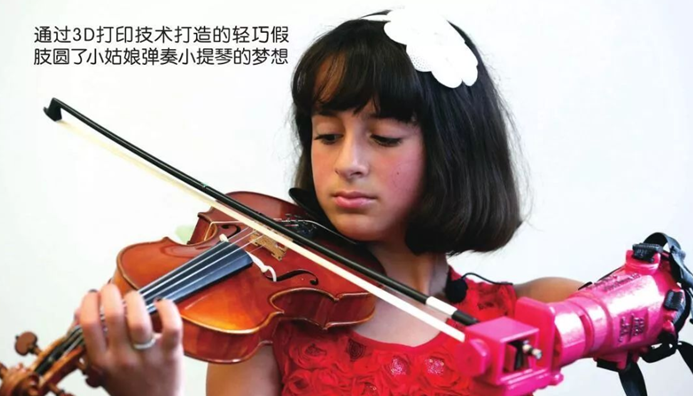
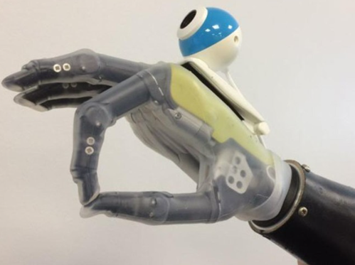
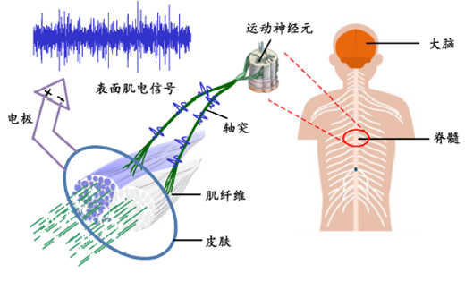
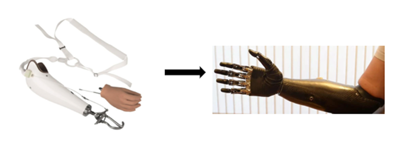
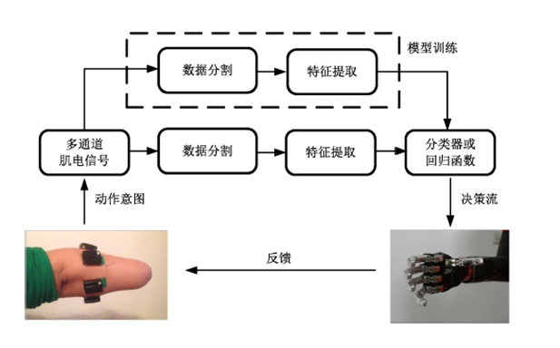
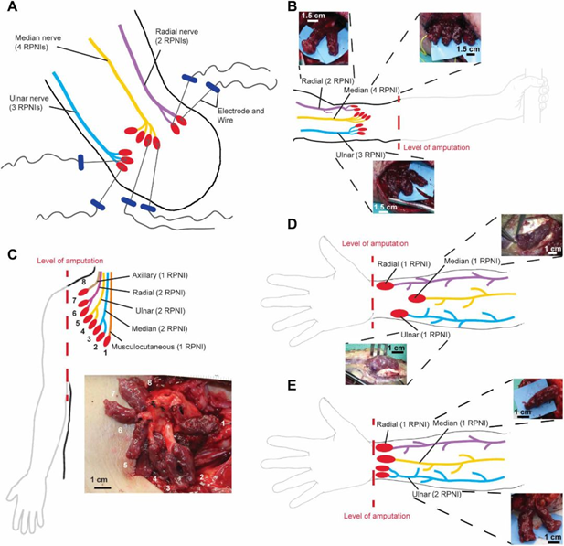
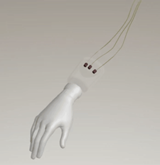
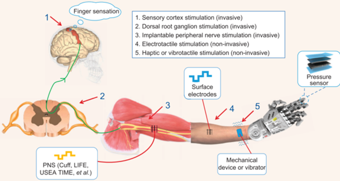
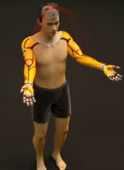

# 心灵手巧-假肢手的进步

**我们正处于一个科技修复躯体的黄金时代，仿生技术的发展点燃了无数人的梦想**

在这个充满奇迹与变革的时代，越来越多的"黑科技"正在为那些曾因肢体残缺而感到失望的人们带来前所未有的希望。新型假肢设备不仅改变了他们的生活，更让他们能够追逐曾经遥不可及的梦想。

比如，美国的一位10岁小女孩，天生左手严重萎缩。然而，3D打印技术为她量身打造了一款轻巧的仿生手，这只手不仅让她的生活变得更加便利，更让她能够实现演奏小提琴的梦想。曾经困扰她的肢体缺陷，如今被科技的力量所修复，她的音乐梦因此焕发出新的光彩。

*图1 使用假肢手拉小提琴的小女孩*

不止如此，英国纽卡斯尔大学的科研团队也在仿生手领域取得了突破性进展。他们开发出了一种能够"看见"周围环境的仿生手[1]。这款手臂不仅能感知物体的形状和位置，还能够自动模拟我们真实手掌的抓取方式，让使用者几乎可以像普通人一样灵活地操作。这一技术为全球无数因事故或疾病失去肢体的人带来了新的希望。

*图2 手背带有摄像头的智能假手*

随着科技的飞速发展，未来的仿生技术无疑将变得更加智能、更加贴近自然，也将为更多失去肢体的人们提供重新掌控生活的机会。这是一个充满无限可能的时代，科技正在一点点地修复那些曾被命运剥夺的梦想，让每个人都有机会以全新的姿态，继续谱写属于他们的精彩人生。

## 一、什么是假肢手

假肢手是一种用于替代或补偿失去或受损的手部功能的人工装置，可以帮助那些由于疾病、事故或先天性因素失去手部的人恢复一定的手部功能，从而提高他们的生活质量和独立性[2]。

假肢手的设计和功能可以有很大差异，取决于其用途和用户的需求。早期的假肢手通常是简单的机械装置，主要依靠用户的残余肢体力量来实现基本的抓握功能。随着科技的发展，现代假肢手变得越来越复杂和智能化，能够通过肌电图（EMG）信号、神经信号或其他形式的传感器进行控制。

*图3 肌电信号产生过程示意图[3]*

*图4 假肢手技术演进示意图*

## 二、当前肌电假肢手的发展

### 21世纪：肌电假肢手

**当前的肌电假肢手主要分为非侵入式和侵入式两种：**

#### 1. 表面肌电假肢手

通过表面肌电信号（sEMG）控制假肢。sEMG信号通过皮肤表面电极捕获肌肉电活动，识别使用者意图（如手部动作/抓握力度）。

*图5 基于模式识别的肌电控制方法[3]*

#### 2. 侵入式肌电假肢手

密歇根大学开发的突破性技术，通过大脑信号精密控制每个手指动作（如玩"剪刀石头布"）。利用再生外周神经接口（RPNI）增强神经信号，实现无需训练的直观控制。

*图6 细丝电极插入肌肉及RPNI手术解剖图[4]*

 
*图7 假肢手指动作演示*

## 三、假肢手的未来发展

### 触觉反馈突破

当前挑战是缺乏触觉反馈。新型系统通过在假肢手指端安装传感器，将信号传输至大脑或皮肤表面，使用户能感知物体形状/温度/质地。

*图8 假肢感觉反馈原理[2]*

### 从功能恢复到人体增强

未来应用将超越功能恢复，成为人体能力增强工具：

* 配备超人类力量/速度/精细度

* 集成多功能工具（如医疗/机械维修专用）

* 支持复杂环境作业（如太空探索）

*图9 可实现弹奏钢琴的智能假肢系统[5]*

## 四、结语：人机合一的未来

假肢手的发展不仅是科技进步，更是对人类未来的探索。随着技术成熟，我们将迎来人机合一的新时代，真正实现"超越身体"的梦想。

*图10 高度灵巧的上肢假肢系统概念*

无论是功能恢复还是探索世界，假肢手的未来充满无限可能。让我们见证这场触觉躯体革命的到来。

### 参考文献

[1] Ghazaei, Ghazal, et al. "Deep learning-based artificial vision for grasp classification in myoelectric hands." *Journal of neural engineering* 14.3 (2017): 036025. 
[2] Jiang, Ning, et al. "Bio-robotics research for non-invasive myoelectric neural interfaces for upper-limb prosthetic control: A 10-year perspective review." *National Science Review* 10.5 (2023): nwad048. 
[3] 何家源. *肌电控制接口的鲁棒特征与用户自适应性研究*. Diss. 上海交通大学, 2016. 
[4] Vu, Philip P., et al. "A regenerative peripheral nerve interface allows real-time control of an artificial hand in upper limb amputees." *Science translational medicine* 12.533 (2020): eaay2857. 
[5] Nazarpour, Kianoush, et al. "Guest editorial: Advances in control of multi-functional powered upper-limb prostheses." *IEEE transactions on neural systems and rehabilitation engineering* 22.4 (2014): 711-715.

