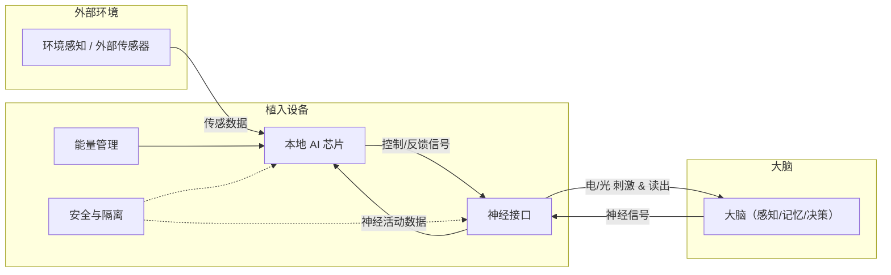

# 人类辅助智能增强装置白皮书（AI-Augmented Human System White Paper）

**作者：Nachuan**
**领域：智能神经工程 / 人机融合技术**

## 一、前言（愿景与动机）

在人工智能迅速发展的时代，人类必须从“使用智能”迈向“整合智能”。
本项目旨在通过植入式辅助智能装置，使人类在不依赖云端AI的前提下，获得持续的感知、认知与行动增强能力，形成 **“自进化智能体（Self-Evolving Human Intelligence）”**。

**关键词：** 脑机接口、神经智能增强、体内AI、认知协同、生物计算

## 二、核心理念：辅助而非替代

当前的脑机接口（如Neuralink）强调**云端AI与大脑的共生闭环**，而本系统强调：

> 以局部自主AI芯片增强人类认知，而非让AI主导意识。

* **目标**：增强人，而非取代人

* **路径**：在人体内部形成智能协同结构

* **哲学立场**：人类的意志仍是核心，AI只是神经层面的“助推层”

## 三、系统总体架构

| 模块           | 功能          | 实现技术              |
| ------------ | ----------- | ----------------- |
| **神经接口层**    | 采集与刺激神经信号   | 柔性电极、光纤神经接口       |
| **AI核心芯片**   | 本地智能计算与模式识别 | 类脑计算 / 低功耗神经网络    |
| **学习与自适应模块** | 长期学习个体模式    | 在线小样本学习算法         |
| **感知协同层**    | 集成外部传感数据    | 微型传感阵列（温度、光、加速度等） |
| **安全与隔离模块**  | 防入侵、防数据泄漏   | 硬件级加密、信号隔离        |
| **能量管理模块**   | 生物能或无线充能    | 葡萄糖燃料电池 / 磁感应供能   |

说明（简要）：环境传感器数据被本地AI处理，AI 将反馈/刺激通过神经接口写入大脑；神经接口也会把大脑活动读回给AI，形成局部闭环。能量管理模块为AI与接口供能；安全模块负责权限与隔离。

## 四、功能设计与应用场景

### 1. 感知增强（Sensory Augmentation）

* 夜视 / 红外视觉增强

* 超声波“回声感知”

* 将信号映射至视觉皮层，实现多模态感知

**应用领域：** 军事侦查、外科显微手术、盲人辅助

### 2. 运动与反应增强（Motor Augmentation）

* AI预测动作意图，提前激活肌肉群

* 微秒级神经信号处理提高反应速度

* 支持神经假肢的自然化控制

**应用领域：** 健身训练、康复医疗、增强型假肢控制

### 3. 认知增强（Cognitive Augmentation）

* 监测注意力与疲劳状态

* AI辅助记忆存储与提取

* 决策时提供实时建议或错误预测

**应用领域：** 教育学习、科研辅助、高危任务决策支持

### 4. 记忆记录与回放（Memory Integration）

* 压缩存储短时记忆的神经模式

* 通过刺激信号“回放”特定体验

* 形成“数字-神经双通道记忆”

**应用领域：** 认知康复、创伤治疗、技能训练

## 五、技术实现要点

| 方向       | 技术需求        | 可行路径                   |
| -------- | ----------- | ---------------------- |
| **信号采集** | 高密度、低噪声神经电极 | CMOS神经接口阵列             |
| **算法**   | 可解释型小规模神经网络 | 节能SNN或Edge Transformer |
| **安全**   | 信号隔离 + 权限控制 | 芯片级加密硬件                |
| **能源**   | 生物能或无线充电    | 体内能量收集技术               |
| **材料**   | 长期生物兼容性     | 柔性导电聚合物、液态金属导体         |

## 六、系统优势对比

| 项目   | Neuralink | 辅助智能装置（本方案） |
| ---- | --------- | ----------- |
| 依赖性  | 云端AI      | 独立本地AI      |
| 数据隐私 | 潜在外泄      | 高度私密、个体所有   |
| 智能架构 | 以云端为主     | 以人脑为主       |
| 能力方向 | 信息上传、交互   | 感知与能力增强     |
| 哲学定位 | 人机共生      | 人类自我增强      |

## 七、伦理与社会影响

* **认知鸿沟**：增强者与普通人之间的能力差距

* **控制权问题**：AI建议与人类意志冲突的边界

* **数据主权**：神经数据应归个体所有

* **人性问题**：当智能装置参与情感与记忆，人类是否仍“完整”

> **核心原则：** “增强人类，而非定义人类。”

## 八、未来研究方向

1. 神经生物能供电系统研究

2. 跨模态感知融合算法

3. 微型脑内AI芯片原型验证

4. 认知安全协议与伦理框架制定

5. 智能装置的人体接口标准化体系

## 九、总结

这是一种以**人类为中心**的未来技术路线：
人类不被AI统治，而是通过智能装置主动进化。
未来的人，将是**人脑 + 辅助智能系统**的混合体。
